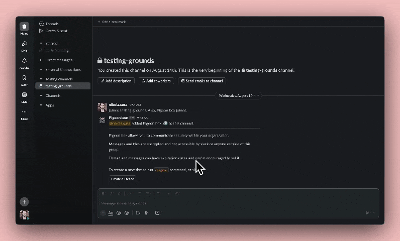
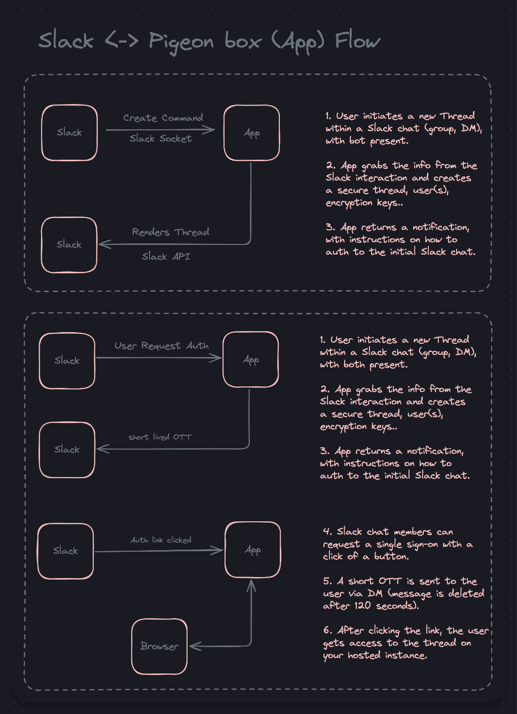
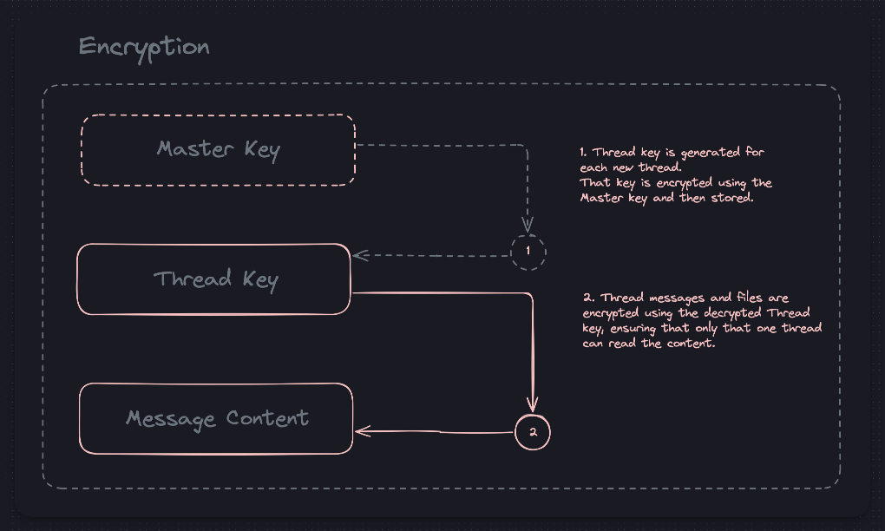
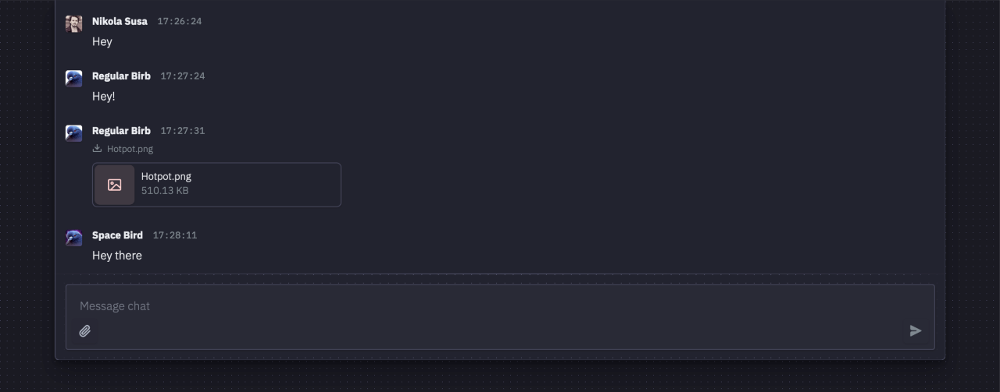

# Pigeon Box

Pigeon box is a simple, secure, open-source chat application built on top of a Slack workspace bot.

Slack is used only for chat(thread) initialization and user authentication, hence Slack never sees the shared messages or files.

Pigeon box is not an alternate to Slack, but an extension.

[flow preview](https://youtu.be/cNoxju0PtXc)

---

## Motivation

1. Secure communication channel for my team, eliminating the need for matrix,pastebin etc.

2. Recent Slack oopses:
    ##### Slack LLM leaking private channel information [^1]

    ##### Slack(Salesforce) wants to use your business data for their AI/ML model training
    > To develop AI/ML models, our systems analyze Customer Data (e.g. messages, content and files) submitted to Slack.[^2]
    
    ##### Disney's Slack data leaked
    > The data allegedly includes every message and file from nearly 10,000 channels, including unreleased projects, code, images, login credentials, and links to internal websites and APIs.[^3]

[^1]: https://promptarmor.substack.com/p/data-exfiltration-from-slack-ai-via

[^2]: https://www.theregister.com/2024/05/20/slack_ts_and_cs_update/

[^3]: https://www.wired.com/story/disney-slack-leak-nullbulge/

---

## How it works

1. Slack user creates a thread via the bot command.
2. Bot creates a message inviting the other slack group user(s) to the thread.
3. Users are able to request a one time link to access the thread.
4. After authenticating, they're able to share messages and files securely.

Messages are stored on your server and are deleted after the set expiration time. They're encrypted using thread specific keys and are never visible to Slack.

  
User flow visualized

  
Encryption visualized

---

## Features

1. Encrypted messages and files. 
   - Encrypted using thread specific keys.
2. Expiring messages and threads.
   - Messages and threads are deleted after the set expiration time.
   - Thread expiration rules are set by the thread creator.
3. User authentication via Slack.
   - Access to threads is restricted to the slack group members only.
   - Authentication is on per thread basis.
4. Real-time thread updates.
   - CRUD on messages and files are synced in real-time.
   - List of currently present users.

---

## Deployment Guides

1. [Slack Bot](docs/GUIDES.md#slack-bot)
2. [Database](docs/GUIDES.md#database)
3. [Server](docs/GUIDES.md#server)
4. [File Storage](docs/GUIDES.md#file-storage)
5. [Environment Variables](docs/GUIDES.md#environment-variables)

---

## Goals

1. Good balance between security and usability.
    - Should be accessible to non-technical users.
    - Should be secure enough to be used by security-conscious teams.
2. Very cheap to run.
    - Should be able to run on a single shared instance.
    - Should be able to run for free or on a sub $5/month budget.
    - Should be able to run on your existing infrastructure (if you have spare resources).
3. Crafting a beautiful, responsive and accessible UI.
    - Should be very intuitive and pleasing to the eye.
    - Should be accessible to screen readers and keyboard users.
    - Should be very light on user resources.

---

