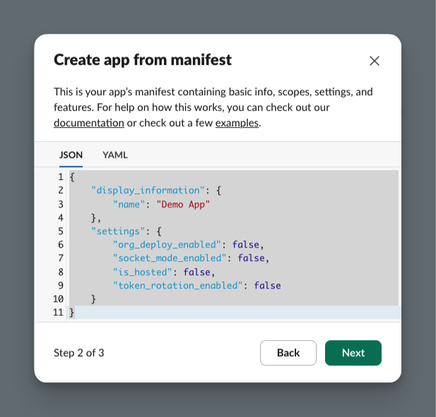
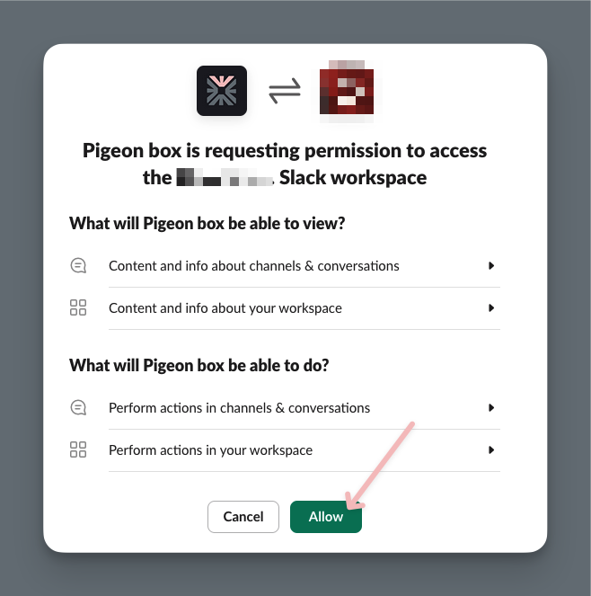

# Guides


## Slack Bot

#### Installing the Slack app

##### Creating a new app flow

:one: https://api.slack.com/apps

:two: Click "Create New App"

:three: Select "From Manifest"

:four: Select your workspace 

:five: Copy the "App Manifest" (below) content and paste it in the editor

<details>
<summary>App Manifest (screenshots)</summary>




</details>


``` yaml
{
    "display_information": {
        "name": "Pigeon box",
        "description": "Communicate securely within your organization",
        "background_color": "#050405"
    },
    "features": {
        "app_home": {
            "home_tab_enabled": false,
            "messages_tab_enabled": true,
            "messages_tab_read_only_enabled": false
        },
        "bot_user": {
            "display_name": "Pigeon box",
            "always_online": true
        },
        "slash_commands": [
            {
                "command": "/pigeon",
                "description": "Create new thread",
                "usage_hint": " [optional name]",
                "should_escape": false
            }
        ]
    },
    "oauth_config": {
        "scopes": {
            "bot": [
                "app_mentions:read",
                "channels:history",
                "channels:join",
                "channels:read",
                "chat:write",
                "chat:write.customize",
                "commands",
                "groups:history",
                "groups:read",
                "im:history",
                "im:read",
                "im:write",
                "mpim:read",
                "mpim:write",
                "reactions:read",
                "reactions:write",
                "team:read",
                "usergroups:read",
                "users.profile:read",
                "users:read"
            ]
        }
    },
    "settings": {
        "event_subscriptions": {
            "bot_events": [
                "app_mention",
                "member_joined_channel",
                "message.channels",
                "message.im"
            ]
        },
        "interactivity": {
            "is_enabled": true
        },
        "org_deploy_enabled": false,
        "socket_mode_enabled": true,
        "token_rotation_enabled": false
    }
}
```


:six: Click "Create"

##### Configuring the app

:one: From "Basic Information" page, scroll down to "App-Level Tokens" and click "Generate Token and Scopes", select "connections:write" scope and click "Generate"

<details>
<summary>Generate token (screenshots) </summary>


</details>


:two: Copy the token and add it to your `.env` file as `SLACK_APP_TOKEN`


:three: Optional: Upload the app icon and cover image from the "Display Information" page

<details>
<summary>Upload App icon</summary>


</details>


##### Install app to workspace

:one: From the "Install App" page, click "Install to Workspace"

:two: Authorize the app

:three: Copy the OAuth Token > Bot User OAuth Token and add it to your `.env` file as `SLACK_BOT_TOKEN`

<details>
<summary>App install (screenshots)</summary>





</details>

---

## Database

Pigeon box uses SQLite (libsql) and is compatible with managed SQLite services.


If you'd still prefer local SQLite, consider persistent storage[^3].


#### Turso
I'd _recommend_ going with Turso, it's easy to set up and offers a very generous free tier (as is, it would be entirely free).

[Turso](https://turso.tech/)

---

## Server

Pigeon can be deployed almost anywhere.

Keeping in mind, the instance has to be publicly accessible (most of the user interactions are via browser).


#### General

Dockerfile is available, and I'll be adding more deployment instructions soon/as necessary.


#### Fly.io

This is the easiest[^1] and very cost-effective[^2] way to deploy Pigeon box.
You can run it on a single `shared-cpu-1x@256MB`[^3] instance with a minimal setup, assuming you're using managed sqlite and cloud storage for files.

[^1]: Minimal technical knowledge is required to deploy on fly.io.

[^2]: Assuming smallest instance in Ashburn, Virginia (US) region, you'd be looking at [~$1.94/mo](https://fly.io/docs/about/pricing/#started-fly-machines).

[^3]: This is the smallest machine size currently available on fly.io


##### Steps to deploy

1. Install the fly CLI (https://fly.io/docs/flyctl/install/) and login.
2. Launch the app from fly.toml, by running `fly launch`
3. Set the env variables in your local .env file (see .env.example)
4. Set secrets using the script `fly_secrets.sh` (see below)


#### Setting up secrets

Assuming you have the fly CLI installed and logged in, and you have env variables set in `.env` file, you can use the following script to set secrets for your fly.io app.

```bash
chmod +x fly_secrets.sh
./fly_secrets.sh
```


## File Storage

Currently, Pigeon box supports the following file storage options:

- Local (should have persistent storage)
- AWS S3 (and S3 compatible services like Tigris)

I'd recommend using S3 or a similar service for your deployment
By default, all files have expiration(auto delete) period, so the cost should be insignificant.

<sup>
Pigeon box is intended for short-lived chats, so even if you don't go with persistent storage, you should be fine in most cases. Just keep in mind that all user data (db, files) will be lost on each machine restart.
</sup>


## Environment Variables

Create a `.env` from the `.env.example` file.
```bash
cp .env.example .env
```

Env names should be self-explanatory, and if not there are helpful comments in the file.

---

### Development Notes


Building styles (tailwind)
``` bash
npx tailwindcss -i assets/static/main.css -o assets/static/build.css --watch
```
